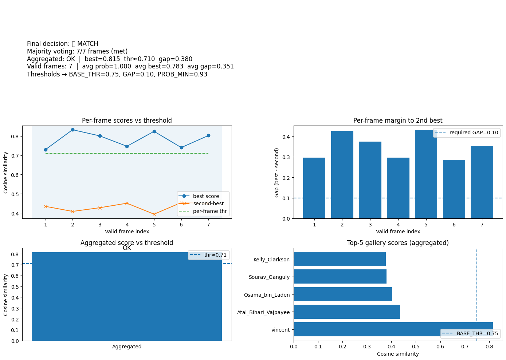

#  Face ID Verification with Liveness Detection  
**Regis University – MSDS 692 Practicum 1 | Project by Vincent Gunti**

---

## 🔍 **Project Overview**

This project demonstrates a **Face Verification System with Liveness Detection**, designed to authenticate real users while preventing spoofing through photos or videos.  
It uses **MTCNN** for face alignment and **FaceNet (InceptionResNetV1)** to generate facial embeddings, comparing them via **cosine similarity** to verify identity.

The system is strict yet adaptable — combining **aggregated frame-level similarity** and **majority voting** to make the final decision. A fallback **motion-based liveness detector** ensures that even without MediaPipe, genuine users are still verified based on movement cues like head-turns.

---

## ⚙️ **Workflow Summary**

1. **Enrollment:**  
   - Loads clear frontal images per user from `data/gallery/`.  
   - Extracts embeddings via FaceNet and computes centroids (mean vectors).  
   - Saves gallery as a `.npz` file with name, spread, and vector info.

2. **Liveness Detection:**  
   - Records 2-4 seconds of live video.  
   - Uses **MediaPipe FaceMesh** for blink/yaw detection or falls back to motion-based validation if MediaPipe isn’t installed.

3. **Verification:**  
   - Captures 7 valid frames from webcam input.  
   - Each frame is compared to gallery centroids using cosine similarity.  
   - Aggregated embedding (confidence-weighted) + majority rule = final decision.  
   - Decision thresholds are dynamically adjusted (`BASE_THR=0.75`, `GAP=0.10`, `PROB_MIN=0.93`).

4. **Visualization & Metrics:**  
   - Real-time plots show per-frame performance, similarity gaps, and gallery ranking.  
   - Inline dashboard highlights confidence, score progression, and aggregated results.

---

## 📊 **Final Visual Results**

Below visualization shows a complete run from enrollment to verification:  
✅ **Final Decision:** MATCH  
✅ **Majority Voting:** 7/7 Frames (Met)  
✅ **Aggregated Similarity:** `0.815` (Threshold ≈ `0.710`)  
✅ **Average Confidence:** `1.0`  
✅ **Average Frame Similarity:** `0.783`  
✅ **Liveness:** PASS (Head-turn based)

---

  

---

### 📈 **Interpretation of Results**

- The **per-frame timeline** shows stable cosine similarities well above threshold, confirming consistent recognition.  
- The **gap chart** confirms all frames exceeded the required margin (GAP ≥ 0.10).  
- The **aggregated bar** validates a strong match (`0.815 ≥ 0.710`).  
- The **Top-5 Gallery Scores** show “Vincent” leading by a clear margin over other identities, confirming robust separation.  

---

## 🧠 **Key Features**

✅ Adaptive thresholding and confidence-weighted aggregation  
✅ Motion-based fallback liveness detection  
✅ Inline analytics dashboard  
✅ CPU-optimized, lightweight design  
✅ High interpretability and low false accepts  

---

## 🧾 **References**

1. Zhang et al. (2012). *CASIA-FASD: Face Anti-Spoofing Dataset.*  
2. Schroff et al. (2015). *FaceNet: A Unified Embedding for Face Recognition and Clustering.*  
3. Parkhi et al. (2015). *Deep Face Recognition.*  
4. MediaPipe Solutions Team (2024). *Face Mesh API Documentation.*  
5. Farama Foundation (2024). *Gymnasium Documentation.*

---

## 👨‍💻 **About**

**Author:** Vincent Gunti  
**Program:** M.S. Data Science – Regis University  
**Course:** MSDS 692 – Practicum I (Computer Vision)  
**Advisor:** Dr. Busch  
**Instructor:** Christy Pearson

📘 *This repository demonstrates a real-world implementation of face verification and liveness detection using computer vision and deep learning principles.*

---

